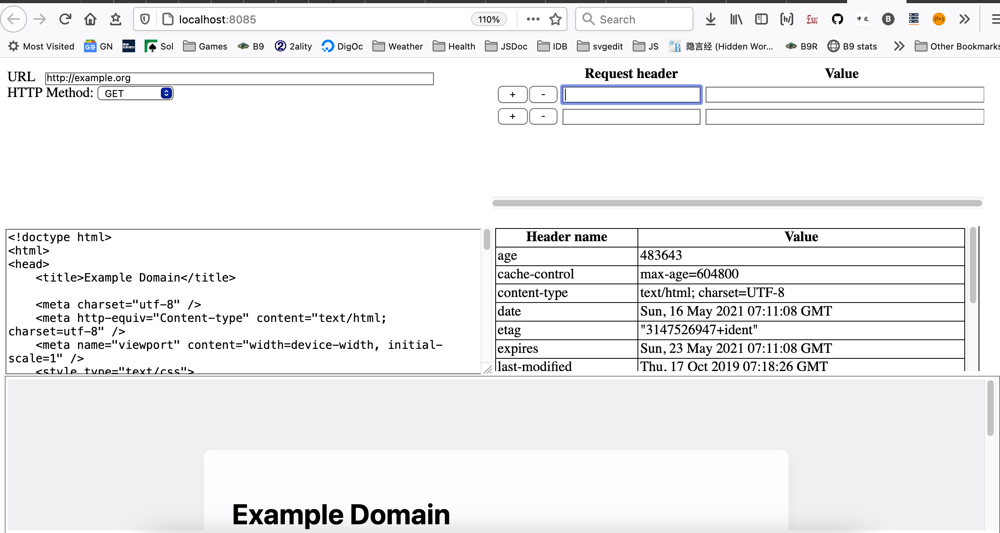

# client-tell

Simple HTTP client app in HTML/Node

## Screenshots

# Installation

`npm i`

# Setup

1. `npm start`
2. Follow instructions on URL to open in browser

# Todos

1. Allow extensions (e.g., to have a special interface for running
    [HTTPQuery](https://github.com/brettz9/httpquery) which should itself be
    upgraded to utilize, support non-eval JSONPath, and also run as middleware
    (demo using [htteepee](https://github.com/brettz9/htteepee)))
    1. Might leverage
        [Link-Template](https://tools.ietf.org/html/draft-nottingham-link-template-01)
        to provide simple forms
    1. Essentially replace my old XSLT/XQuery add-ons with an area
        for evaluating JavaScript, perhaps preloading
        [jtlt](https://github.com/brettz9/jtlt) combined with
        syntax to make CORS (or proxified) HTTPQuery to retrieve
        JSONPath/CSS Selectors/XPath results and transform.
1. Allow for prepopulating based on reading in file format via webappfind
    (and add this repo to
    [webappfind-demos-samples](https://github.com/brettz9/webappfind-demos-samples))
1. Add Cypress tests for UI and server
